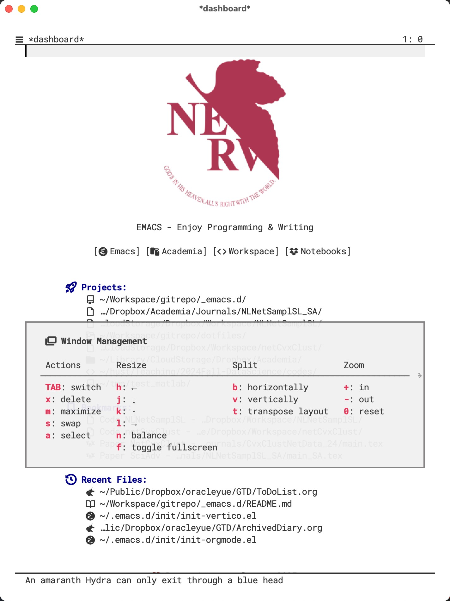
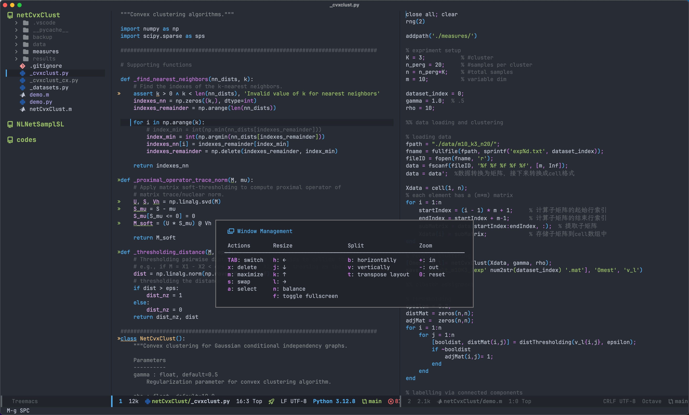

# My configurations for a fancy modern Emacs

## Features

You may refer to `init-const.el** to select/enable features.

**Completion**:

- use `Vertico + Consult + Embark` (+`Orderless`, +`Marginalia`) or `Ivy + Counsel + Swiper` as the general completion system;

- use `Corfu`, `Company` or `completion-at-point` (may or may not be taken over by `Ivy` or `Vertico** for better completion**.

You may refer to `init/init-vertico.el` (or `init/init-ivy.el`) for keybindings. Or press `M-g` and wait for `which-key` to raise cheatsheet.

**Helper**:
use `which-key` and `hydra** for quick help or cheatsheet.

**Programming**:

- LSP: use `eglot` or `lsp-bridge` for LSP support (`lsp-mode` has no longer been maintained);

- DAP: use `dape` for debugging support;

- Tag system: use `citre** as the modern frontend for universal ctags;

You may use `M-s SPC` to raise the hydra popup for programming utility keybindings.

**Window Management**:
use `M-g SPC` to raise the hydra popup for window management.

## Snapshots

